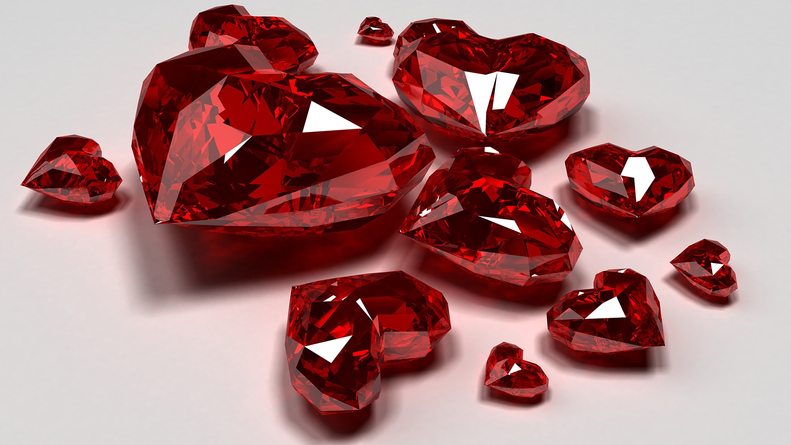
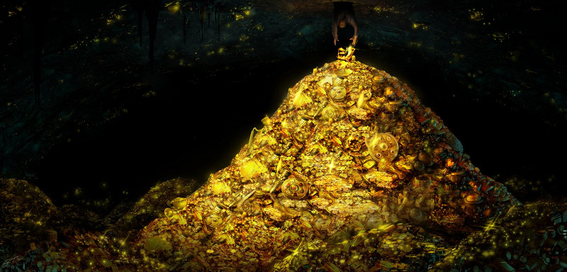
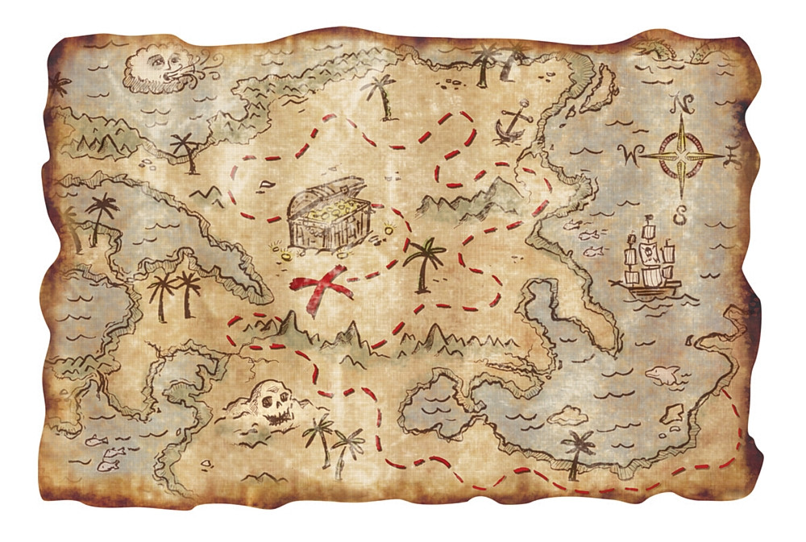
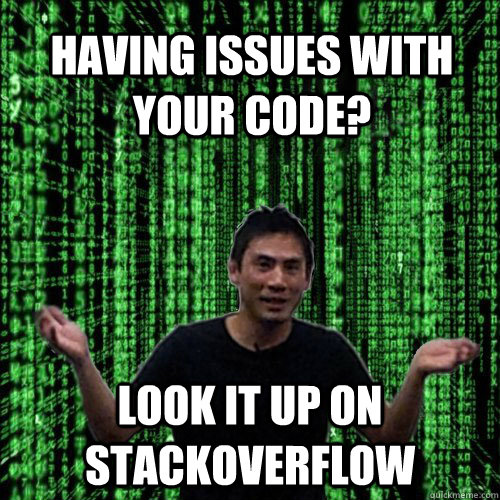

## The Treasures of Ruby, one for each day

Christophe Philemotte, Paris.rb, 6 May 2013

---

### About me

* Developer ([@toch on GitHub](https://github.com/toch), [@_toch on Twitter](https://twitter.com/_toch))
* Author on [blog.8thcolor.com](http://blog.8thcolor.com)
* CoFounder of PullReview [https://pullreview.com](https://pullreview.com)

---


---

> I hope to see Ruby help every programmer in the world to be productive, and to
> enjoy programming, and to be happy. That is the primary purpose of Ruby
> language.
> **Matz, 2008**

---

```
contacts = %w[Granny Bill]
contacts << 'Granny' unless contacts.include? 'Granny'
```

---

```
tags_post1 = [ 'ruby', 'rails', 'test' ]
tags_post2 = [ 'test', 'rspec' ]

common_tags = []
tags_post1.each { |tag| common_tags << tag if tags_post2.include? tag }
```

---


---



---

### String: How to remove accents and diacritics?

---

```
keyword = 'Kurt Gödel'


```

---

```
keyword = 'Kurt Gödel'

keyword.tr(
  "ÀÁÂÃÄÅàáâãäåĀāĂ㥹ÇçĆćĈĉĊċČčÐðĎďĐđÈÉÊËèéêëĒēĔĕĖėĘęĚěĜĝĞğĠġĢģĤĥĦħÌÍÎÏìíîïĨĩĪīĬĭĮįİıĴĵĶķĸĹĺĻļĽľĿŀŁłÑñŃńŅņŇňʼnŊŋÒÓÔÕÖØòóôõöøŌōŎŏŐőŔŕŖŗŘřŚśŜŝŞşŠšſŢţŤťŦŧÙÚÛÜùúûüŨũŪūŬŭŮůŰűŲųŴŵÝýÿŶŷŸŹźŻżŽž",
  "AAAAAAaaaaaaAaAaAaCcCcCcCcCcDdDdDdEEEEeeeeEeEeEeEeEeGgGgGgGgHhHhIIIIiiiiIiIiIiIiIiJjKkkLlLlLlLlLlNnNnNnNnnNnOOOOOOooooooOoOoOoRrRrRrSsSsSsSssTtTtTtUUUUuuuuUuUuUuUuUuUuWwYyyYyYZzZzZz"
)

```

---

```
keyword = 'Kurt Gödel'

require 'active_support/inflector' # not necessary if Rails

ActiveSupport::Inflector.transliterate('Kurt Gödel')


```

---

specific rules into `locales/de.yml`

```
i18n:
  transliterate:
    rule:
      ü: "ue"
      ö: "oe"
```

---

### String: How to clean up invalid byte sequences?

---

```
ArgumentError: invalid byte sequence in UTF-8
```

---

```
line = "This is an invalid byte sequence \244"


line.upcase

```

---

```
ArgumentError: invalid byte sequence in UTF-8
```

---

```
line = "This is an invalid byte sequence \244"
line.encode!('UTF-8', 'binary', invalid: :replace, undef: :replace, replace: '')

line.upcase

```

---

```
line = "This is an invalid byte sequence \244"
line.scrub!('') # gem 'string-scrub' if < 2.1

line.upcase

```


---

### Array: How to avoid duplicates in an Array?

---

```

contacts = %w[Granny Bill]
contacts << 'Granny' unless contacts.include? 'Granny'

```

---

```

contacts = %w[Granny Bill]
contacts << 'Granny'
contacts.uniq!
```

---

```
require 'set'
contacts = Set.new(%w[Granny Bill])
contacts << 'Granny'

```

---

### Array: How to find what elements are common to 2 Arrays?

---

```
tags_post1 = [ 'ruby', 'rails', 'test' ]
tags_post2 = [ 'test', 'rspec' ]

common_tags = []
tags_post1.each { |tag| common_tags << tag if tags_post2.include? tag }
```

---

```
tags_post1 = [ 'ruby', 'rails', 'test' ]
tags_post2 = [ 'test', 'rspec' ]

common_tags = tags_post1 & tags_post2

```

---

### Hash: How to filter out some keys of a Hash?

---

```
histogram = {
  monday: 5,
  tuesday: 7,
  wednesday: 10,
  thursday: 18,
  friday: 7,
  saturday: 2,
  sunday: 0
}
```

---

```


histogram = histogram.select { |k, _| k != :saturday && k != :sunday }
```

---

```
def filter(hsh, *keys)
  hsh.select { |k, _| !keys.include? k }
end

filter(histogram, :saturday, :sunday)
```

---

```
def filter(hsh, *keys)
  hsh.reject { |k, _| keys.include? k }
end

filter(histogram, :saturday, :sunday)
```

---

```


require 'active_support/core_ext/hash' # not necessary if Rails

histogram.except(:saturday, :sunday)
```

---

### Hash: How to find the differences between two Hashes?

---

```
entries = {
  1372284000 => "CVE-2013-4073",
  1368482400 => "CVE-2013-2065"
}

updated_entries = {
  1385074800 => "CVE-2013-4164",
  1372284000 => "CVE-2013-4073",
  1368482400 => "CVE-2013-2065"
}
```

---

```
new_entries = updated_entries.reject { |k, _| entries.include? k }
```

---


---



---



---

#### 1. Read the doc: yes, the full page

---

* Ruby Doc [http://ruby-doc.org/](http://ruby-doc.org/)
* Rails Doc [http://api.rubyonrails.org/](http://api.rubyonrails.org/)
* Apidock [http://apidock.com/](http://apidock.com/)
* OmniRef [https://www.omniref.com/](https://www.omniref.com/)

---

#### 2. Read the source, Luke


---

* Gem source
* Rails source [https://github.com/rails/rails](https://github.com/rails/rails)

----

#### 3. SO, Google



---

#### 4. Blogs, Podcasts, Conferences, Meetup...


---

#### 5. Discuss


---

* Your coworker/colleague
* A friend
* ME :)